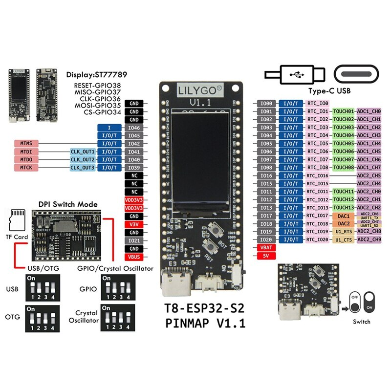

# ssis:bit

AIO microcomputer solution with CircuitPython, display and battery for SSIS students.


## Hardware

CircuitPython supports [more than 200 different boards](https://circuitpython.org/downloads). Locally available is the [TTGO T8 ESP32-S2 ST7789](https://circuitpython.org/board/lilygo_ttgo_t8_s2_st7789/) at several online stores. The board includes the powerful 240MHz CPU, 4MB Flash and 8MB PSRAM, a 1.14" ST7789 display, a microSD card slot for virtually unlimited local data storage, battery connector 1.25mm JST with charge controller and regular USB-C connector. And buildin WiFi, of course.


The planned adapterplate adds a 3-way button for input, place to hold the little 350 mAh battery and interface for I2C with regular 2.54mm 4pin JST XH as well as the small Stemma QT 1mm JST SH connector (QWIIC).

## Software


The ssis:bit runs [CircuitPython](https://circuitpython.org/) and can be easily programmed with the [Mu Editor](https://codewith.mu/en/). There is a lot to learn on [Adafruit with CircuitPython]() and with their great libraries there is less frustration getting things started.

## GPIO

This document from LilyGO documents the pins of the T8.



In CircuitPython the following pins are available"

``` py
import board
dir(board)
['__class__', '__name__', 'BATTERY', 'DISPLAY', 'IO0', 'IO1', 'IO11', 'IO12', 'IO13', 'IO15', 'IO16', 'IO17', 'IO18', 'IO19', 'IO2', 'IO20', 'IO21', 'IO3', 'IO39', 'IO4', 'IO40', 'IO41', 'IO42', 'IO45', 'IO46', 'IO5', 'IO6', 'IO7', 'IO8', 'IO9', 'LCD_BCKL', 'LCD_CLK', 'LCD_CS', 'LCD_D_C', 'LCD_MOSI', 'LCD_RST', 'PE_POWER', 'RX', 'RX1', 'SD_CLK', 'SD_CS', 'SD_MISO', 'SD_MOSI', 'TX', 'TX1', 'board_id']
```

To find he assigned pins we running
```
"""CircuitPython Essentials Pin Map Script"""
import microcontroller
import board

board_pins = []
for pin in dir(microcontroller.pin):
    if isinstance(getattr(microcontroller.pin, pin), microcontroller.Pin):
        pins = []
        for alias in dir(board):
            if getattr(board, alias) is getattr(microcontroller.pin, pin):
                pins.append("board.{}".format(alias))
        if len(pins) > 0:
            board_pins.append(" ".join(pins))
for pins in sorted(board_pins):
    print(pins)
```

And get

```
board.BATTERY board.IO9
board.IO0
board.IO1
board.IO11 board.SD_MOSI
board.IO12 board.SD_CLK
board.IO13 board.SD_MISO
board.IO15
board.IO16
board.IO17 board.TX1
board.IO18 board.RX1
board.IO19
board.IO2
board.IO20
board.IO21
board.IO3
board.IO39
board.IO4
board.IO40
board.IO41
board.IO42
board.IO45
board.IO46
board.IO5
board.IO6
board.IO7
board.IO8
board.LCD_BCKL
board.LCD_CLK
board.LCD_CS
board.LCD_D_C
board.LCD_MOSI
board.LCD_RST
board.PE_POWER
board.RX
board.SD_CS
board.TX
```

## History

More will be updated in the [docs/history](./history) document, but the idea is from 2020 with the [t-display](https://github.com/kreier/t-display) board. Similar idea: Not just the Microcomputer but included power supply (LiPo), display (just 240x135 color) and input device (not keyboard, but 3 buttons) to have it always with you and ready to use.
